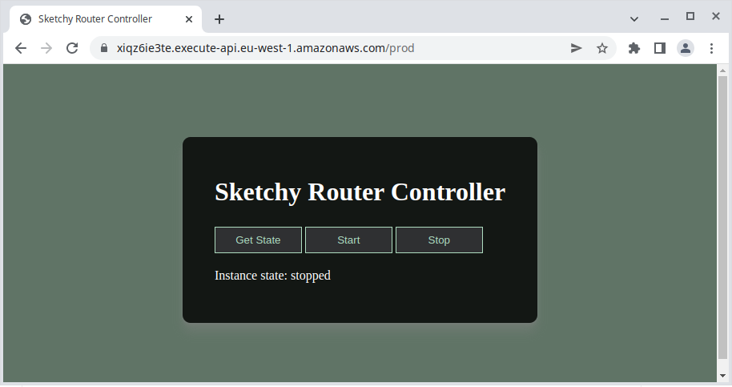

# Sketchy Router Controller

Basic web page control of EC2 instance power state with Amazon API Gateway.

## Features

- Power on/off a specified EC2 instance from a web browser
- Implemented **completely** in Amazon API Gateway
- Free to run under AWS free tier

## Why!?

I use an EC2 instance to route traffic over a WireGuard VPN for accessing region-locked content.

Certainly not illegal but potentially ethecially sketchy.

## Screenshot

